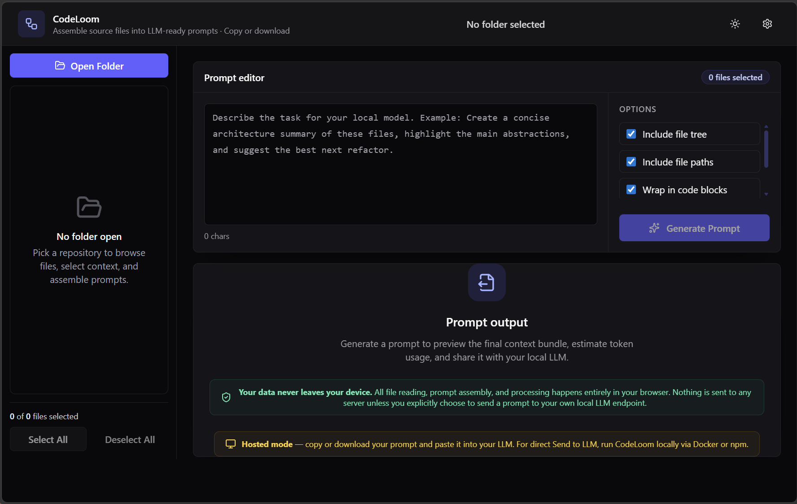

# 🧶 CodeLoom


**Weave your source files and prompts together for local LLM consumption**

CodeLoom is a browser-based workspace for assembling source files, repository context, and task instructions into a prompt-ready package. It is built for privacy-first local workflows, keeping file access, prompt generation, and output handling on the user's machine.

## Features

- 🗂️ **Selective file intake** for choosing only the files that matter
- 🧵 **Prompt assembly** with file trees, file paths, and content formatting controls
- 📏 **Token estimation** to keep prompt size visible before export
- 📋 **Clipboard-ready output** for fast handoff into local workflows
- 🔌 **LLM bridge support** for local chat-completions-style endpoints (local deployment only)
- 🔒 **Client-side privacy** with zero server-side repository processing
- 🖥️ **Environment-aware UI** — automatically detects local vs. hosted and surfaces the right features

## Screenshot



## Quick Start

### npm

```bash
npm install
npm run dev
```

### Docker

```bash
docker compose up --build
```

Then open `http://localhost:8080`.

> Note: Docker builds with a root base path (`/`) so static assets resolve correctly at `localhost`. GitHub Pages keeps using the `/CodeLoom/` base path.

## How It Works

1. **Select Files**  
   Choose a local directory, expand the tree, and mark the files you want to include.
2. **Write Prompt**  
   Add instructions, choose output options, and shape the final context package.
3. **Generate & Copy**  
   Build the prompt, review the token estimate, and copy the result for local model usage.
4. **Send to LLM** *(local deployment only)*  
   When running locally, send the assembled prompt directly to Ollama or any OpenAI-compatible endpoint and chat with it.

## Hosted vs. Local

CodeLoom runs in two modes, automatically detected at page load:

| Capability | GitHub Pages | Docker / npm dev |
| --- | :---: | :---: |
| File browsing & selection | ✅ | ✅ |
| Prompt assembly & token estimation | ✅ | ✅ |
| Copy & download prompt | ✅ | ✅ |
| LLM endpoint configuration | — | ✅ |
| Send to LLM / chat | — | ✅ |
| Model detection & connection testing | — | ✅ |

**Why?** Browser security (CORS) prevents a public HTTPS site from reaching services on your local network. When CodeLoom runs from `localhost`, the browser allows these connections natively — no special configuration needed.

## Privacy & Security

CodeLoom is designed as a 100% client-side application. File reading, filtering, prompt assembly, and token estimation happen in the browser, and no built-in server sends repository content elsewhere. Container deployment serves only static assets.

Network requests are only made from the browser directly to user-configured model endpoints (for example, when detecting models, testing a connection, or sending prompts/chats). CodeLoom does not upload repository or prompt data to any CodeLoom-managed server.

## Tech Stack

| Layer | Technology |
| --- | --- |
| Build tooling | Vite |
| UI | React |
| Language | TypeScript |
| Styling | Tailwind CSS |
| State | Zustand |
| Container runtime | Docker |
| Static serving | Nginx |

## Development

```bash
npm install
npm run dev
npm run build
npm run lint
```

See the [documentation hub](./docs/README.md) for architecture notes, API references, and contribution guidance.

## Deployment Options

- **Docker** *(recommended for full LLM features)* — `docker compose up --build` → `http://localhost:8080`
- **npm development server** — `npm run dev` → `http://localhost:5173/CodeLoom/`
- **GitHub Pages** — prompt assembly, copy & download (LLM features hidden)
- **Static hosting** — serve the `dist/` directory; LLM features available when served from localhost

### GitHub Pages URL

- `https://mattvevang.github.io/CodeLoom/`

## Contributing

Contributions are welcome. See [docs/contributing.md](./docs/contributing.md) for setup, workflow, and pull request guidance.

## License

MIT
